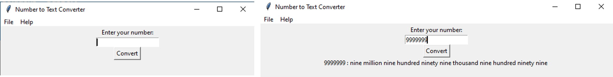

[](https://requires.io/github/aibenStunner/Number-to-Text-Converter/requirements/?branch=master)


# Number-to-Text-Converter
This is a simple number to text converter.

## Motivation :seedling:
 Had just learnt the basics of python and wanted to try something out, so I built this :smile:
 
## Installation :package:
1. Clone the repo
```bash
   git clone https://github.com/aibenStunner/Number-to-Text-Converter.git
   cd Number-to-Text-Converter
```

## Usage :computer:

```bash
    python NumberToText.py
```

## Demo :video_camera:

This is preview of the application.




## Built with :house:

- Tkinter
   
## Credits :open_book:
- Tkinter docs
  https://docs.python.org/3/library/tk.html
  
  
 ## License :key:
 
 LGPL-3.0
 &copy; Gadri Ebenezer
